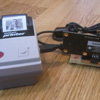
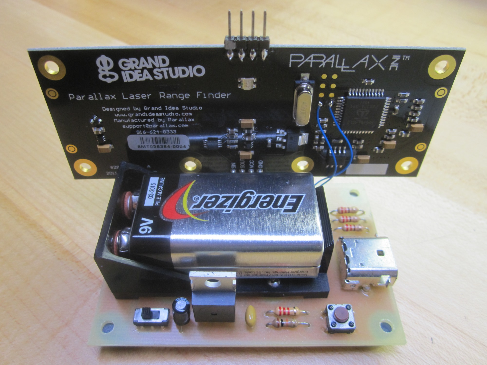
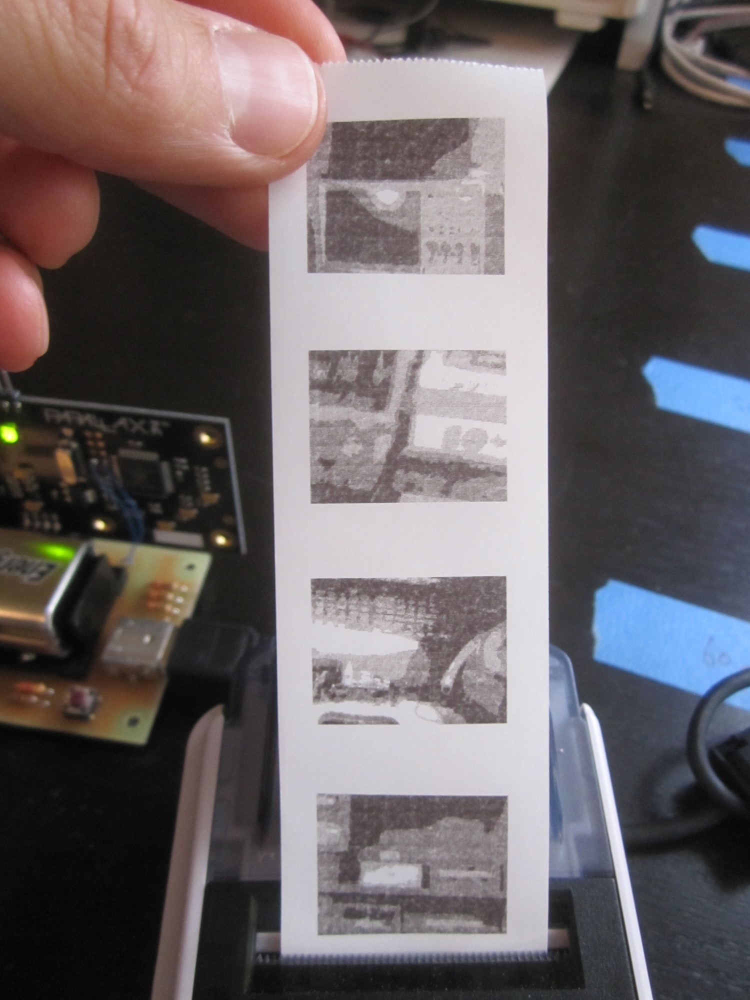
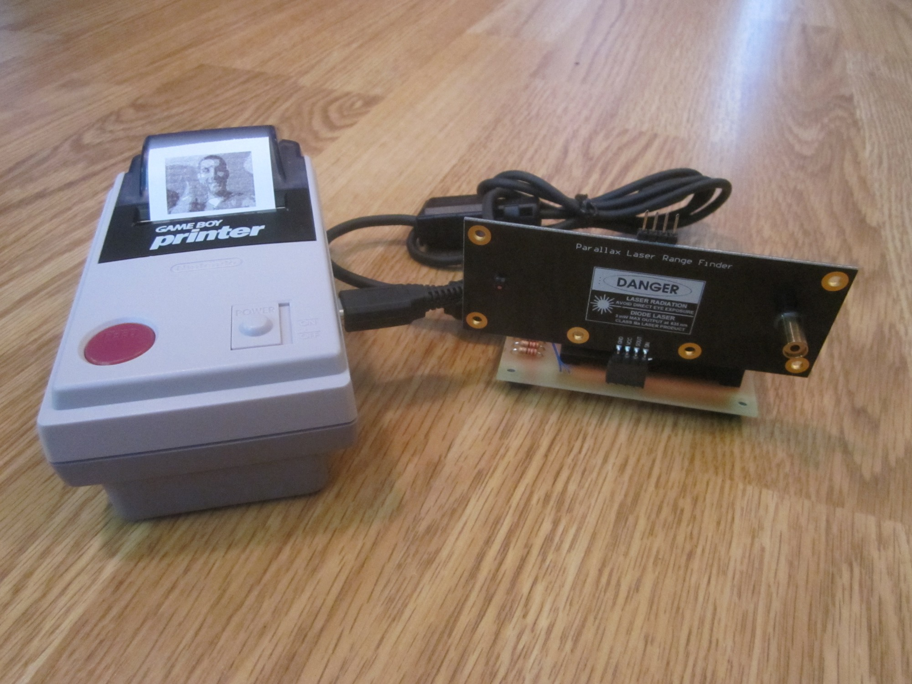

# LRFCam (LRF + Game Boy Printer)

By: Joe Grand

Language: Spin, Assembly

Created: Apr 1, 2013

Modified: April 26, 2013

This project combines a Parallax Laser Ranger Finder module with a Nintendo Game Boy Printer to create a portable "instant camera."

It uses my new Game Boy Printer object _(http://obex.parallax.com/objects/814/)_ and a modified version of the original LRF firmware _(Only the required camera interface, frame grab, and serial communication functionality is retained from the original code. All other code has been removed.)_

When the pushbutton switch is pressed, the LRF will grab a single frame _(8 bits/pixel greyscale, 160 x 128 resolution)_. The contents of the frame will be processed and transmitted to the Game Boy Printer via Nintendo's proprietary synchronous serial interface. The printer will then print the image.

The schematic and some photos are included in the Auxiliary Files section. Go to the LRFCam project on Grand Idea Studio's Laser Range Finder page _(http://www.grandideastudio.com/portfolio/laser-range-finder/)_ for full interface details.

