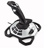

# Logitech Extreme 3D Pro Driver

By: Keith Young

Language: Spin, Assembly

Created: Aug 10, 2013

Modified: August 10, 2013

This object allows a highly functional human input device that is normally USB driven to have functionality with Prop. By simply removing some screws and unplugging a few wire plugs, you can connect the wires as shown to a breadboard or PCB and make use of all motions and buttons.  
  
The sampling rate is very high.  
  
To keep the code trimmed down and fast, the code section for the 6 base buttons was commented out. Simply uncomment these sections for the added functionality of the 6 base buttons. Be aware, with the standard RadioShack wires I'm using for this I can't fit in enough wires to use the 6 base buttons without some physical modifycation to the joystick such as drilling.  
  
This object requires MCP3208\_fast\_ADC and FullDuplexSerial. They are included in the zip.  
  
Also required will be an ADC circuit. I recommend at a minimum the 4 Channel ADC sold by Parallax according to the link:  
  
http://www.parallax.com/StoreSearchResults/tabid/768/txtSearch/adc/List/0/SortField/4/catpageindex/2/ProductID/574/Default.aspx  
  
Follow the documentation for the chip as far as how to connect it. My object shows how to connect the respective channels themselves.  
  
The specific joystick is this one:  
  
http://www.amazon.com/Logitech-Extreme-Joystick-Silver-Black/dp/B00009OY9U  
  
This is my first OBEX upload so please rate and comment. It's especially important that when it works please let others know so they aren't afraid of $30 bucks for the joystick.  
  
I should also probably point out I'm not affiliated with Logitech and I make no money if you make this purchase.  
  
Rate, comment, and ENJOY.
