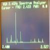

# Low Cost 2.4GHz Spectrum Analyzer

By: DogP

Language: Spin

Created: Aug 3, 2009

Modified: May 2, 2013

This object is a 2.4GHz Spectrum Analyzer using a low cost CYWM6935 module, outputting to a VGA monitor. This appliction sweeps from 2.400GHz to 2.527GHz in 1MHz steps, using the RSSI values of channels 0 through 127 to determine power level. Levels are from 0 to 31, although the values aren't calibrated to any standard measurement.

There is code for enabling a peak hold as well as a cursor, although I didn't define an interface for controlling these. It could be connected to buttons, keypad, serial port, etc.

The interface to this module is SPI, as well as misc pins, several of which can likely be omitted if desired. Note that the module uses a 12 pin 2mm connector rather than the standard 0.1". This could probably be used in a custom circuit using the CYWUSB6935 chip as well. The CYWM6935 module has trace antennas on the board.

This program could be expanded on to make use of the communication features as well, although it's probably not one of the best communication devices, since the speed is slow and the range is quite limited. The module is FCC Approved though, so it may be of use to some. Make sure you only transmit in the channels legal for your territory (according to the manual, US FCC regulations allow only from channel 2 to 79).

I borrowed a lot of the code from the Beau Schwabe's Audio Spectrum Analyzer and SPI Demo, as well as some C code floating around for a similar project on the AVR, which doesn't seem to have a home or author.
