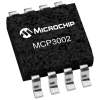

# MCP3002 ADC Single-Ended SPI Driver

By: Andrew Enright

Language: Other

Created: Mar 17, 2017

Modified: March 23, 2017

This is a simpleIDE SPI driver for the MCP3002 10-bit ADC I wrote for a project. I didn't see an existing driver for it, so I figured I'd write one. All you actually need to do is unzip into your library folder and #include "MCP3002.h".

UPDATE: Updated 23 March 2017 to address issue of inaccuracy between ground and VMax. Now works as intended.

FILES INCLUDED:

MCP3002.c

MCP3002.h

MCP3002library.side (SimpleIDE project file)

MCP3002library.c (Test harness)  
\_\_\_\_\_\_\_\_\_\_\_\_\_\_\_\_\_\_\_\_\_\_\_\_\_\_\_\_\_\_\_\_\_\_\_\_\_\_\_\_\_\_\_

It works in single-ended mode only -- which means it can measure each of two channels from 0V to VREF. if you want to work in double-ended mode, go into the MCP3002.c file and find the comment where it says //boot sequence... 

C doesn't support object instantiation, so this library has just one method:

float MCP3002\_getVolts(int ch, int mosi, int miso, int clk, int cs\_adc, float vref)

 CH is 0 or 1.

MOSI means Master Out, Slave In, which connects to DI on the ADC.  
MISO means Master In, Slave Out, which connects to DO on the ADC.

CLK is the bus clock. It connects to the eponymous pin on the ADC.

CS\_ADC is the ADC's chip select. If you have an ADC and an SD card sharing a bus make sure they have different CS lines!

VREF is the voltage reference, should be between 2.7 and 5.5 volts for best results.

A simple (heh heh) program is included to test your setup.

If you have any problems, or feedback, please let me know via message or forums!
