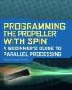

# MCP3202 Reader in SPIN

By: Harprit

Language: Spin

Created: Apr 1, 2013

Modified: April 1, 2013

Demonstrates reading of Channel 0 of MCP3202 to Propeller using very simplified SPIN code. Complete documentation and comments for beginners.  Easy to convert from here to other languages. 

From book for absolute beginners

Harprit Sandhu
