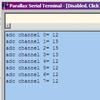

# MCP3208 Demo

By: Mike Rector-KF4IXM

Language: Spin

Created: Apr 11, 2013

Modified: April 11, 2013

This demo demonstrates the Microchip MCP3208 8 channel adc chip connected to the Parallax Propeller Demo Board. It uses the MCP3208.spin object Written by Chip Gracey and outputs the adc value _(0-4096)_ of all 8 channels _(labeled as 0-7)_ in Parallax Serial Terminal.
