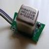
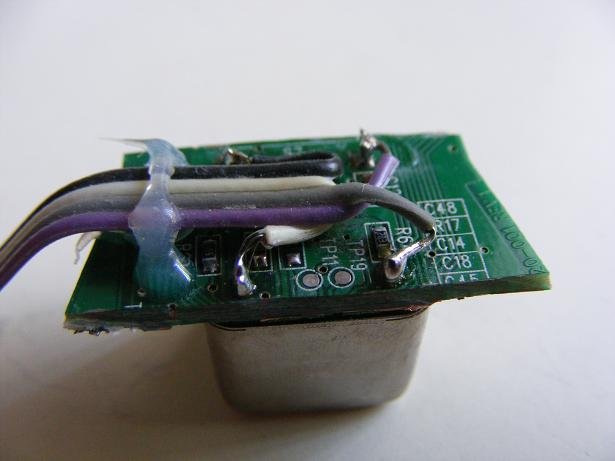
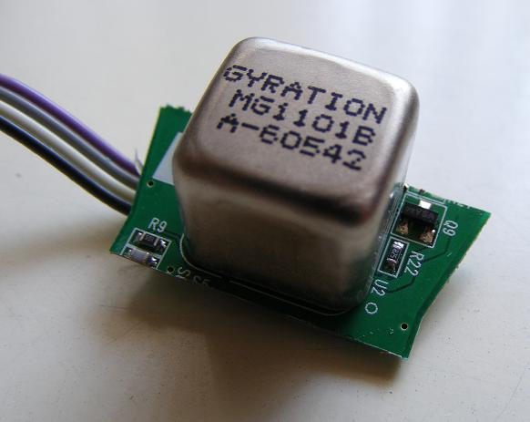
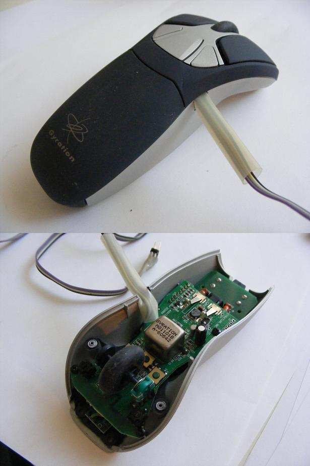

# MG1101 gyroscope Object

By: Eric R

Language: Spin

Created: Apr 11, 2013

Modified: April 11, 2013

Interface to the Gyration MG1101 dual axis gyroscope. Has two demo programs and one object.

One demo shows engineering units of degrees/sec, millivolts, and degrees Celsius.

The other demo shows update and poll rates, including use of lower level routines. The gyroscope updates axis rates 30 times per second. The object can poll the gyroscope faster than the update rate.

Tested with MG1101B gyro salvaged from Gyration Air Mouse. 1.0a corrects instructions in demos to show correct Propeller pin numbers (thanks tim pifer).

