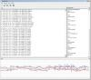

# MPU-6050 Complementary Filter Demo

By: Zack Lantz

Language: Spin

Created: Sep 19, 2013

Modified: October 6, 2013

This is a Complementary Filter Demo for the MPU-6050. It sends Accel X, Y, Z, Gyro X, Y, Z, and cFiltered X, Y, Z in CSV Format to PC running Serial Chart ( http://code.google.com/p/serialchart/ ). 
