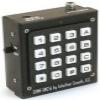
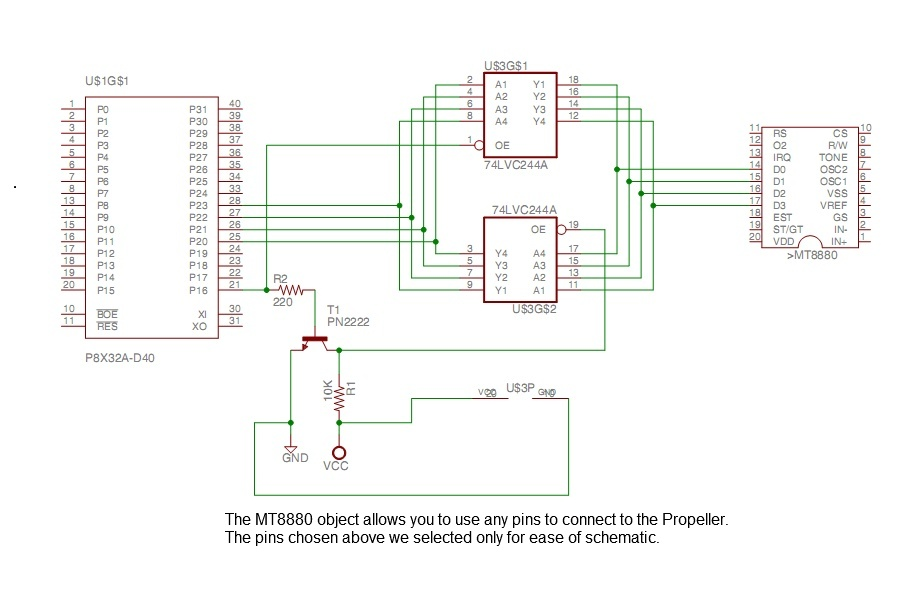

# MT8880 DTMF Transceiver

By: eod_punk

Language: Spin

Created: Apr 11, 2013

Modified: April 11, 2013

MT8880 DTMF Transceiver

This object uses a 74LVC244 buffer in between the Propeller (3.3v) and the MT8880(5v). It also uses a PN2222 NPN transistor to select one of 2 buffers in the 74LVC244.

The separate demo shows how to Send DTMF and receive 4 digits via DTMF and compare them to known 4 digit codes in the DAT block and turn an LED on and off.

