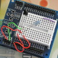

# Magic IR

By: Gadget Gangster

Language: Spin, Assembly

Created: Apr 10, 2013

Modified: April 10, 2013

Magic IR stores & plays any arbitrary IR code, as received from an IR receiver (like a Vishay TSOP4838) and played back with any common IR LED.

It's perfect for IR remote controls. A demo is included in the code archive and a video demonstration is here - http://www.vimeo.com/14551986
