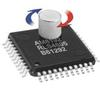

# Magnetic encoder, RLS AM256L (and similar)

By: Graham Stabler

Language: Spin, Assembly

Created: Apr 10, 2013

Modified: April 10, 2013

An object to read an absolute magnetic encoder in serial mode. Code can be used as is and launched in to a cog, modified to work for multiple encoders or used as code to insert in to other assembly code. Read time for the encoder is roughly 40us.
