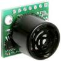

# MaxSonar

By: HarrisonHJones

Language: Spin

Created: Apr 10, 2013

Modified: April 10, 2013

Interfaces the propeller to the MaxBotix MaxSonar sonar range finder. More information at: http://www.maxbotix.com/MaxSonar-EZ1\_\_FAQ.html.  
UPDATED! Version 1.1 Interfaces with the MaxSonar's PWM input!
