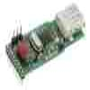

# Memory Stick Datalogger

By: Paul

Language: Spin

Created: Mar 28, 2013

Modified: March 28, 2013

**Please see v1.1 for latest updates. v1.0 is provided here as a legacy resource.**

Object for interfacing with Parallax's USB Datalogger, product #27937.

Requires: Paul's Standard Library

This object uses the standard version of Full\_Duplex\_Serial to communicate with the data logger via UART (serial, non-SPI) mode.

Later revisions of this code will include schematics, pin definitions, and a demo program. For now, these are basic, working functions.

The main limitation is the lengthy startup procedure, taking up to five seconds to "boot." If someone can show me what I am missing, I would greatly appreciate it!
