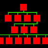

# Memory Storage Management Lightweight

By: Brandon Nimon

Language: Spin

Created: Oct 7, 2010

Modified: May 2, 2013

This object is designed to allow programmers (and/or end-users) to store values to EEPROM, referenced by name rather than just a number.

It is similar to a simple database system. The values can be stored in numerical byte, word, or long values. All of the values are created, edited, and retrieved with a simple name.

This is great for storing user-created settings or values that need to be accessed at a later time with profile names or user entries. In the right hands, it can be used for just about any EEPROM application.

**NOTE**: a heavyweight version of the object exists. It allows for storage of strings, stacks, and arrays. It also has methods to store values across multiple blocks in the EEPROM. 

**NOTES:**

This object supports and includes both the SPIN and PASM versions of I2C Drivers.
