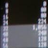
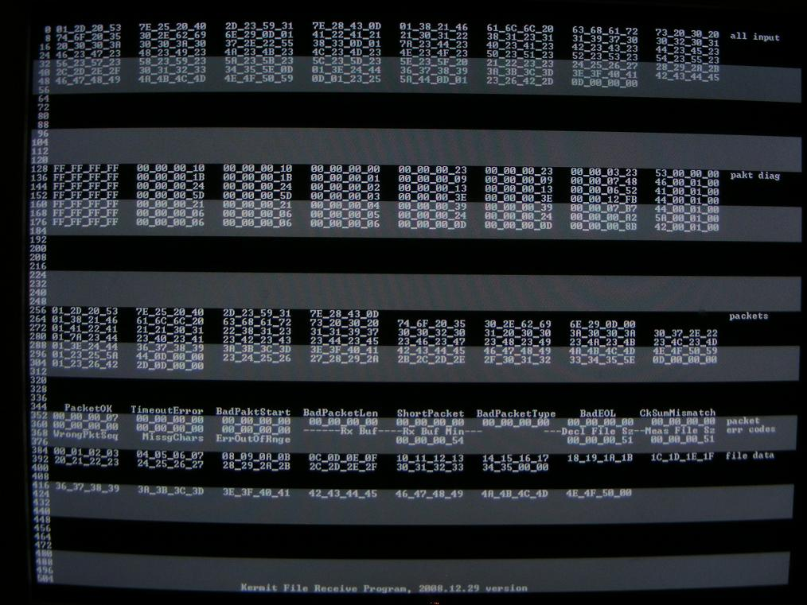
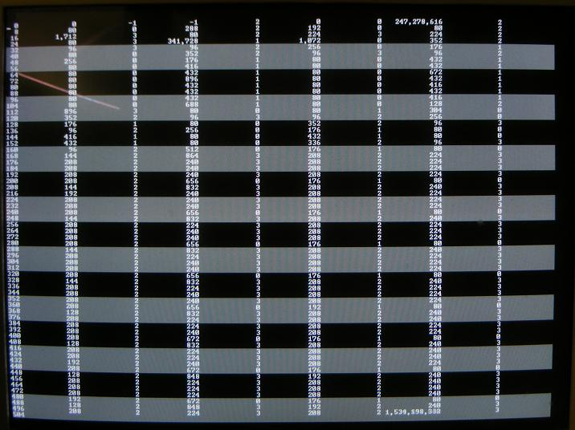

# MonVarsVGA

By: Eric R

Language: Spin

Created: Aug 2, 2008

Modified: May 2, 2013

For program debugging by showing long variables live.

Displays values of variables in an array. Can show up to 512 longs at 1024 x 768 resolution. Appears as a grid of numbers and text on a VGA monitor.

Version 2.0 adds Unsigned Hex, Signed Hex, and text display (in addition to existing signed decimal. Adds features for showing bytes in correct sequence on screen within long variables. No longer needs "VGA\_HResTerminal" object.

