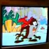

# Movie player

By: James Moxham

Language: Spin, Assembly

Created: Apr 11, 2013

Modified: April 11, 2013

Movie player for the propeller. Uses Kye's SD card driver and Kye's 160x120 VGA color driver. Zip contains demo code and a 20 second movie. Also contains a static screen loader. Copy prop160.vga and taz.pmv to an sd card connected to pins 12-15. Please contact the author for code and instructions for making your own movie. More details at http://www.smarthome.viviti.com/propeller
