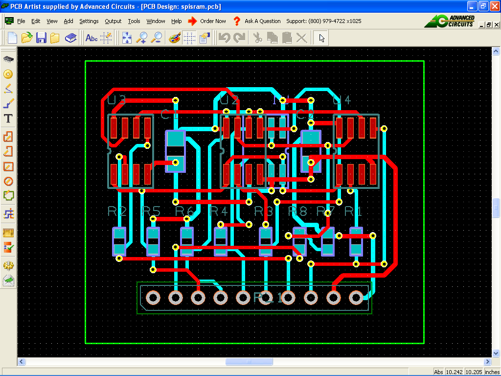

# N256S0830HDA SPI SRAM driver

By: Tim Moore

Language: Spin, Assembly

Created: Mar 28, 2013

Modified: April 11, 2013

Driver for SPI-SRAM N256S0830HDA. 3 drivers in download for 1 bit, 2bit and 4 bit wide memory board. Download contains schematic and PCB layout for a 4bit wide memory board. Driver is also a example of how to do SPI using counters for SPI clock, allows SPI speeds upto 10MHz.

