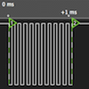

# NCOburst

By: Tracy Allen

Language: Spin

Created: Apr 11, 2013

Modified: April 11, 2013

Makes bursts of pulses, a given number at a given frequency. Uses cog counters, from Spin.  
Frequency can range from 1 Hertz up to 40 MHz, burst length up to 26+ seconds. (at clkfreq = 80MHz, 2^31 cycles)  
The companion demo program allows the frequency within burst and the number of pulses to be entered and verified at the debug terminal.

Example uses:

*   Generate a number of led pulses as a helpful indicator of status.
*   Generate a burst of 40kHz for an ultrasonic transducer.
*   Generate a burst with a certain number of pulses to move a stepper motor or actuator a desired distance. e.g. 57 pulses at 3 MHz to drive a stepper motor 57 steps
*   Generate up/down pulses to set a digital potentiometer
*   Generate a burst to refresh a high voltage in a DC to DC conversion scheme.
*   Generate laser pulses for a sensor or communication scheme.
*   Generate a radio frequency blip

All from Spin
