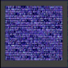

# NTSC 8x8 TV Text Driver

By: Doug Dingus

Language: Spin, Assembly

Created: Apr 12, 2013

Modified: April 12, 2013

NTSC Character mode driver. Uses HUB memory font character definition, 8x8 character cells, features two color per screen mode, and two color per cell mode.

Screen memory is one byte per character (in two color per screen mode), making strings and numbers easy to display.

Overall memory footprint can be as little as 2KB.

On screen text sizes range from 10 to 70 characters horizontal, in two color per screen mode, 10 to 40 characters, in two colors per character mode. Vertical size is 8 pixels, it is possible to define the number of rows in the display however. This ranges from 5 to 27 rows.

Archive files compile on HYDRA. The clock, crystal and TV pin code elements are noted for easy change to your particular Propeller setup.

This revision stable.

Edit: All code MIT licensed now. No other changes. A multi-cog version of this will appear in the near future.
