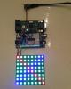

# NeoPixel Driver

By: Chris Cantrell

Language: Spin, Assembly

Created: Jan 12, 2015

Modified: January 12, 2015

This driver generates the high-frequency data protocol required to talk to a line of NeoPixel RGB LEDs (I used the following 8x8 NeoPixel grid from AdaFruit: https://www.adafruit.com/products/1487). The driver reads pixel data from a pixel buffer in shared memory.

One driver COG can update several lines of NeoPixels. Or separate driver COGS can be spun up to manage each NeoPixel line.
