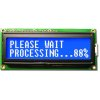

# NewHaven Serial LCD Display driver

By: Ron Czapala

Language: Spin

Created: Apr 11, 2013

Modified: May 2, 2013

This object drives the NewHaven line of serial LCDs  

These displays may have 2 or 4 lines and 16 or 20 columns - the init method specifies the number of lines and columns.
