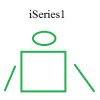

# Newhaven ft812 display library

By: Michael Burmeister

Language: C, Other

Created: Aug 30, 2018

Modified: January 21, 2019

This library is for driving an FT812 resistive touch display module with the size of 5 inches or 800x480 pixels.

The library has a test page that can be used to see how objectes are created on the screen.

Now includes instruction dump function with debug option to decode display list commands. Not turned on by default.

Change most of the commands to match the GUI tool FTDI EVE Screen Editor.  This makes it easier to build the screens from the source of the tool.

Added more commands.

