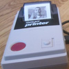

# Nintendo Game Boy Printer interface

By: Joe Grand

Language: Spin

Created: Apr 12, 2013

Modified: April 12, 2013

This object provides the communication interface to a Nintendo Game Boy Printer. It includes a demo object to print one of three sample images.

The object is inspired by furrtek's GBLink/PC interface project (http://furrtek.free.fr/index.php?p=crea&a=gbpcable&i=2) and Reversing the Game Boy Printer page (http://furrtek.free.fr/index.php?p=crea&a=gbprinter).

The SIN pin (serial input TO Propeller) must be pulled up to VCC via a 15k resistor. Refer to the LRFCam project on Grand Idea Studio's Laser Range Finder page (http://www.grandideastudio.com/portfolio/laser-range-finder/) for a hardware connection example.
