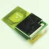

# Nordic nRF2401 Rf Tranceiver Handler

By: allen marincak

Language: Spin, C

Created: Apr 12, 2013

Modified: April 12, 2013

This is a new version of the handler, with a semaphore to serialize the TX and RX functions, and the documentation has been improved and cleaned up. This is a basic handler for the Nordic nRF2401 2.4 GHz tranceiver. Modules are sold at various vendors (SparkFun, QKits, and others). The TRF24G.spin module handles the device, the NordicDemo.spin (and FullDuplexSerial.spin) are a simple test program to run the handler code.

March 2009, added a C version (Imagecraft ICCV7 Compiler). This is a straight port of the basic SPIN version (minus semaphores and separate COG, you can add that as needed).
