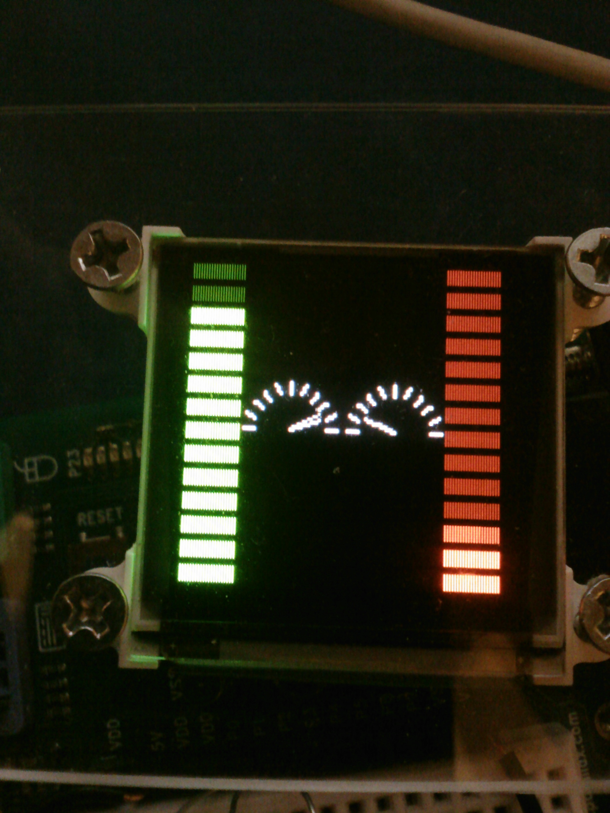

# OLED-128-G2 Driver Demo

By: Parallax Inc

Language: Spin

Created: Jan 22, 2015

Modified: January 22, 2015

General info:

This is a simple/small driver for the OLED-128-G2.  This driver uses the common Parallax serial terminal as it's main  
communication system.  This OLED is a good choice for many reasons and seems to have a little bit of everything.  It  
can draw boxes, lines, triangles. It can display text and graphics and makes it relatively easy to understand.  It is  
capable of 65 thousand colors in two bytes and has a resolution of 128x128 pixels.  It also uses a reliable  
communication system.

Revision History:  uOLED-128-G2

*   10-05-2013 (V1.0)
    *   \- first release
*   10-25-2013 (V1.1)
    *   \- added two functions that were undocumented in original GOLDELOX-SPE-COMMAND-SET-REV1.3 datasheet
    *   \- changed constant naming to reflect PICASO-GFX2-4DGL-Internal-Functions-rev3 datasheet
*   11-07-2013 (V2.0)
    *   \- improvements to Fxn call reducing overall code by 98 LONGS
    *   \- significant overall speed improvements through optimization
*   11-08-2013 (V2.1)
    *   \- compatibility updates to command structure

**NOTE:** Datasheets mentioned in the Revision History (above) are available for download using the links below (not included in the zip download for this object):

*   http://www.parallax.com/sites/default/files/downloads/28081-Goldelox-Spe-Command-set-v1.3.pdf
*   http://www.4dsystems.com.au/downloads/Semiconductors/PICASO-GFX2/Docs/PICASO-GFX2-4DGL-Internal-Functions-rev3.pdf

