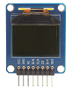

# OLED96 Spin Driver Parallax Product ID: 28087

By: Terry E Trapp, KE4PJW

Language: Spin, Assembly

Created: Jan 10, 2017

Modified: January 31, 2019

This Spin driver is for the Parallax "96 x 64 Color OLED Display Module" Product ID: 28087. It is for the SSD1331 driver chip using a 5-wire, write-only SPI interface. Features:

*   String to on screen text. It utilizes both the internal Parallax font as well as a smaller font built into the driver.
*   Rectangle Draw
*   Line Draw
*   Screen Copy
*   Reverse Screen Copy
*   Screen Clear
*   Screen Scroll
*   Color Invert
