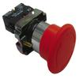

# Octal Button Debouncer

By: Kwabena W. Agyeman

Language: Spin

Created: Apr 12, 2013

Modified: April 12, 2013

An octal button debouncer driver that runs on one cog. The code has been fully optimized with a super simple spin interface for maximum speed and is also fully commented.

Provides full support for:

*   Getting a debounced button's state.
*   Getting how long a debounced button has been in that state.
*   Getting if a debounced button was pressed.
*   Getting if a debounced button was released.
