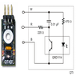

# Octal QTI Line Sensor Driver

By: Kwabena W. Agyeman

Language: Spin, Assembly

Created: Apr 12, 2013

Modified: April 12, 2013

An octal QTI line sensor driver that runs on one cog. The code has been fully optimized with a super simple spin interface for maximum speed and is also fully commented.

Provides full support for:

*   Getting the raw light measurment value from the QTI sensor.
*   Getting the scaled (0 to 255) light measurment value from the QTI sensor.
