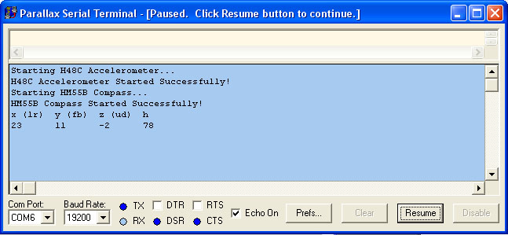
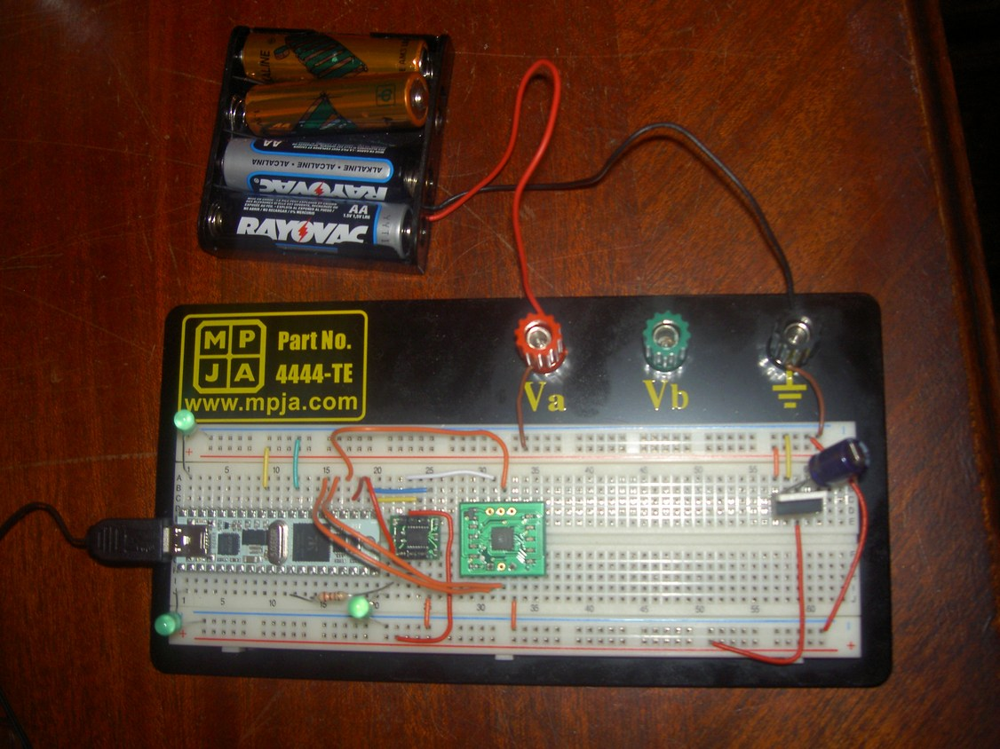

# Orientation Demo using H48C and HM55B

By: Travis

Language: Spin

Created: Apr 12, 2013

Modified: April 12, 2013

This demo connects a PropStick USB to the H48C Accelerometer and HM55B Compass. It outputs the

x,y,z from the H48C and the heading from the HM55B to the Parallax Serial Terminal (via FullDuplexSerial).

It also flashes the LEDs to indicate the program is running.

It's very well documented including schematics/pin diagrams, links to relevant documentation and links to needed software. This was written as a comprehensive tutorial for somebody new to the PropStick.

Objects used:

*   H48C : "Sensor.H48C.Accelerometer" 'custom SPIN file located in source folder
*   HM55B : "Sensor.HM55B.Compass" 'custom SPIN file located in source folder
*   Debug : "FullDuplexSerial" 'standard from propeller library

Components needed:

*   Breadboard w/ connector wire set
*   5-9V power supply (9v battery or 4 AA batteries)
*   PropStick USB
*   H48C Accelerometer
*   HM55B Compass
*   3 LEDs
*   1 270 Ohm resistor
*   1 - LM2940 5 volt regulator
*   1 - 1000uf capacitor

Software/Downloads needed:

Propeller Tool Software (used to program the Prop):

http://www.parallax.com/Portals/0/Downloads/sw/propeller/Setup-Propeller-Tool-v1.2.5.exe

FTDI USB VCP Drivers (for WinXP):

http://www.parallax.com/Portals/0/Downloads/sw/R9052151.zip

Parallax Serial Terminal:

http://www.parallax.com/Portals/0/Downloads/sw/propeller/PST.exe.zip

Relevant Documentation:

PE-Lab-Setup-for-PropStick USB v1.0.pdf (Simple LED Code and 5 volt power supply)

http://www.parallax.com/Portals/0/Downloads/docs/prod/prop/PE-Lab-Setup-PropStick-USB-v1.0.zip

32210-PropStickUSB-v1.1.pdf (Schematic of PropStick USB)

http://www.parallax.com/Portals/0/Downloads/docs/prod/prop/32210-PropStickUSB-v1.1.pdf

HitachiH48C3AxisAcelerometer.pdf (Schematic of H48C Accelerometer)

http://www.parallax.com/Portals/0/Downloads/docs/prod/acc/HitachiH48C3AxisAccelerometer.pdf

HM55BModDocs.pdf (Schematic of HM55B Compass)

http://www.parallax.com/Portals/0/Downloads/docs/prod/compshop/HM55BModDocs.pdf

WebPM-v1.01.pdf (Detailed SPIN language documentation 

http://www.parallax.com/Portals/0/Downloads/docs/prod/prop/WebPM-v1.01.pdf

Basic Build Instructions:

1.  Configure the components based on the PIN diagrams below. Use a breadboard for testing purposes.
2.  Download and install the required software (listed above).
3.  Open the Propeller Tool Software.
4.  From within the Propeller Tool Software, open this file (Orientation Demo using H48C and HM55B.spin).
5.  Connect the PropStick USB to the computer.
6.  Power on the PropStick USB with 5-9v.
7.  From within the Propeller Tool Software, hit F7 to confirm communication with PropStick USB.
8.  From within the Propeller Tool Softwere, hit F10 to compile and load program into the PropStick USB. Make sure this file (Orientation Demo using H48C and HM55B.spin) has the focus when you hit F10, otherwise the file with current focus is loaded onto the PropStick.
9.  Open the Parallax Serial Terminal.
10.  From within the Parallax Serial Terminal, make sure the COM Port is set to the COM port indicated when you hit F7 from the Propeller Tool Softwere and the Baud Rate is 19200 (unless you changed it in this file below).
11.  From within the Parallax Serial Terminal, click 'Enable' (which should be flashing anytime the PropStick USB is connected).
12.  Confirm the screen is output the readings from the sensors.

Diagrams Included

*   Pin Diagram for PropStick USB
*   Pin Diagram for HM55B
*   Pin Diagram for H48C
*   Pin Diagram for 5V Power Supply

