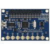

# P8X32A QuickStart board LED Fun

By: Rick Nungester

Language: Spin

Created: Aug 24, 2013

Modified: August 24, 2013

This short Spin program generates interesting patterns on the board's 8 LEDs that repeat after about 1.7 minutes. As an alternative to leaving your board unused in a drawer, it turns it into a conversation piece. The program implements a 32-bit Linear Feedback Shift Register (LFSR) with seed value 1 and XOR feedback taps at bits 30 and 31, resulting in a 1023-state pseudo-random number generator with attractive bit patterns. The 8 LS bits of the value are mapped to the board LEDs. See the attached video for the result.
