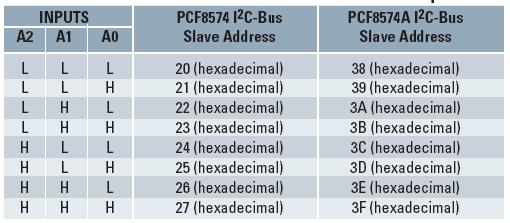

# PCF8574 Driver

By: crgwbr

Language: Spin

Created: Apr 12, 2013

Modified: April 12, 2013

Very Small Driver for PCF8574 I2C 8-bit I/O Expander. Only 81 longs in size. Based off of from Michel Green's "Basic I2C Driver."

