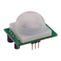

# PIR Sensor

By: Joshua Donleson (parallax)

Language: Spin

Created: Apr 12, 2013

Modified: April 12, 2013

Interfaces the PIR sensor with the Propeller.  
PIR senses movement and temperature changes within a proximity of about 20 feet. The PIR module can run either on 3.3 VDC or 5 VDC. However, this example program utilizes a 5 VDC supply from the Demo Board with an output to LED on PIN 16.
