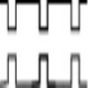

# PWM_Nctrx

By: Tracy Allen

Language: Spin, Assembly

Created: Apr 12, 2013

Modified: November 11, 2015

Updated 10-November-2015.  Revision allows higher frequency operation, better control of the offset phase, accounting for delay in starting the two counters.

This object generates standard PWM, selectable frequency and high/low ratio, using the cog counters. Once running, no program intervention by spin or pasm is required until the frequency or period need to be changed. This requires two cog counters in NCO mode, and the PWM is achieved by addressing them both to the same pin and running them both at the same frequency with offset phases. A third cog counter is used as a dumb inverter to provide a comlimentary output over the full 0% to 100% range.   There are two separate objects here. 

"PWM\_3ctrx\_spin\_demo" starts the PWM using spin only.   Demo asks for pin, frequency (Hz) and percent high width.  The complimentary outputs appear on pin and pin+1

"PWM\_3ctrx\_pasm\_demo" starts a pasm cog which sets up and starts the counters in that cog.   Demo asks for pin, frequency (Hz) and width as proportion 0 to 256.  The complimentary outputs appear on pin and pin+1
