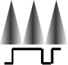

# PWM_triangle_ctrxbeat

By: Tracy Allen

Language: Spin

Created: Apr 11, 2016

Modified: April 11, 2016

\-- Generates conventional PWM that increases and decreases linearly with time

\-- Can be filtered to a triangle waveform

\-- Uses 2 cog counters in NCO mode directed to the  same output pin, long cycle at the beat frequency

   No program loops required for basic operation, cog counters only.

\-- Counters in a second cog can provide inverted output,

   and also a lower frequency square wave synchronized to the beat frequency

\-- Operation can be viewed on an oscillosope, probes connected to

      pin     main output is PWM varying from 50% to 100% high at the selected frequency

      pin+1    inverse of pin, varies between 0% and 50%

      pin+2    low frequency square wave at that flip flops at the inflection points

\-- The second cog is not needed unless you need the inverted signal and/or the beat frequency

   In an applicaton, the second set of cog counters can be patched into an existing cog that does not otherwise need its counter modules.

\-- Also see http://obex.parallax.com/object/482, method to set fixed frequency and duty cycle PWM with counters.
