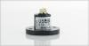

# PWMin for MAE absolute encoder in C

By: Henk Kiela

Language: C

Created: Mar 29, 2015

Modified: March 29, 2015

The MAE3 is a small magnetic absolute encoder of US digital. We have been using it in various robot projects. So far is was only available in Spin. We made a C-version available derived from the standard Pulsein code in the C simple libraries.

The MAE creates a 4 kHz PWM signal with a duty cycle of 0% to 100% and 12 bit resolution. As we wamt to use this device to commutate brushless motors of control steering robot wheels, the sensor passes through the 100%->0% transition at some point. None of the standard PWM in routines in the OBEX seem to be able  to detect such transitions without errors or a very long measuring time. The introduction of the state engine in the modigied routine helps to detect 0% and 100% within a reasonable time.

If you have comments or suggestions, let us know.

Henk Kiela Opteq Mechatronics BV hkiela@opteq.nl
