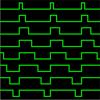

# PWMx8

By: Phil Pilgrim (PhiPi)

Language: Spin, Assembly

Created: Apr 12, 2013

Modified: April 12, 2013

Provides up to 8 channels of fast PWM output per cog, generated by the Propeller's video circuitry.
