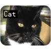

# Propeller Backpack TV Overlay

By: Phil Pilgrim (PhiPi)

Language: Spin, Assembly

Created: Apr 12, 2013

Modified: April 12, 2013

This object permits the overlay of characters upon a standard NTSC video source, using the Propeller Backpack _(#28327)_. It consists of the overlay object proper, plus three top-level programs: a serial terminal program and two demo programs. The documentation for this object is included in the archive. Addenda pertaining to user-definable characters can be found as comments in the overlya object.
