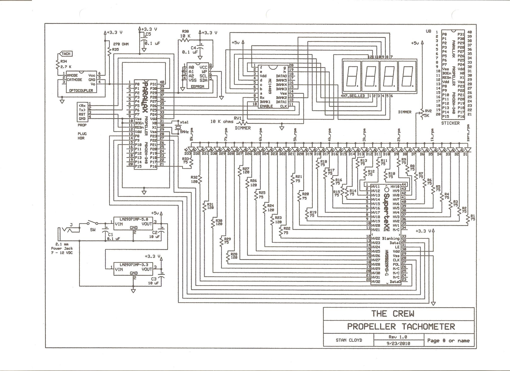
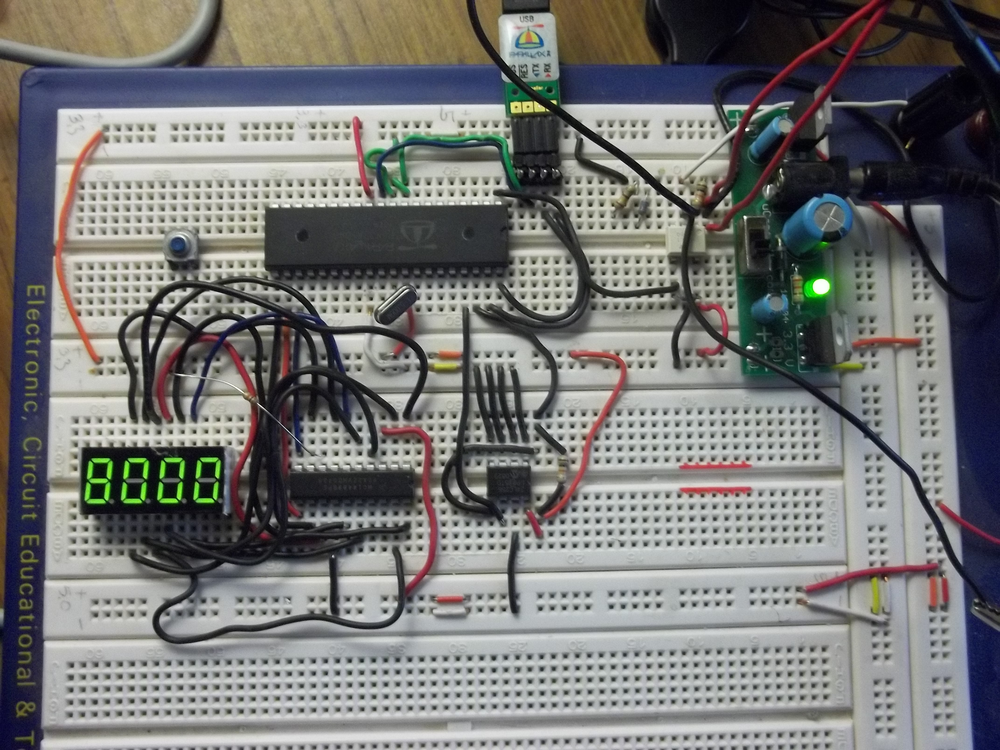

# Propeller automotive tachometer digital display

By: yarisboy

Language: Spin

Created: Apr 12, 2013

Modified: April 26, 2013

This object is for a Propeller based tachometer driving a Futurlec 7FG3641-AG 4x7 segment green LED display. The 0-12 volt square wave input signal drives an Fairchild H11L1M single channel opto-isolator. The "opto" generates an isolated 0-3.3 volt safe input signal for the Prop pin-0. Using background counters, OBEX downloadable object jm\_freqin.spin calculates the frequency of the input. The top object calculates the RPM _(crankshaft revolutions per minute)_ based on a 4-cylinder, 4-stroke internal combustion engine (ICE). OBEX downloadable object synth.spin is used to generate a clock pulse for the spi Motorola MC14489 LED driver chip.

The top object converts the decimal RPM value to a hex-string that the MC14489 can decode and display. The deterministic way in which shift-out is controlled has raised eye-brows of more experienced programmers but, hey, diversity happens! A strict interpretation of the spec sheet and the Spin users manual, without any interrupt driven experience, has generated a non-main stream algorithm. It's slow but it works. When there is no input signal (key on, engine off) the program uses the anunciator option of the driver chip to display "rPnn" indicating that it is a tachometer display. The reason for this may become clear in rev 1.1 of the top object. Stay tuned.

