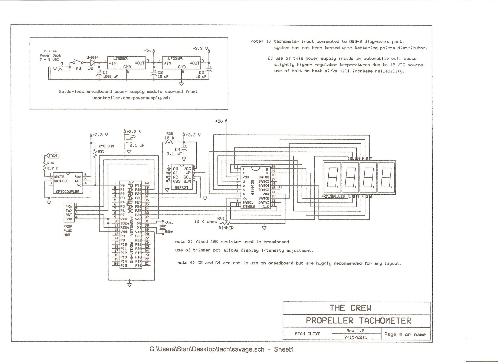

# Propeller automotive_tachometer digital display

By: yarisboy

Language: Spin

Created: Apr 12, 2013

Modified: April 26, 2013

Automotive tachometer object to read the OBD-2 connector or ignition coil and display RPM on a 4x7 segment LED.

