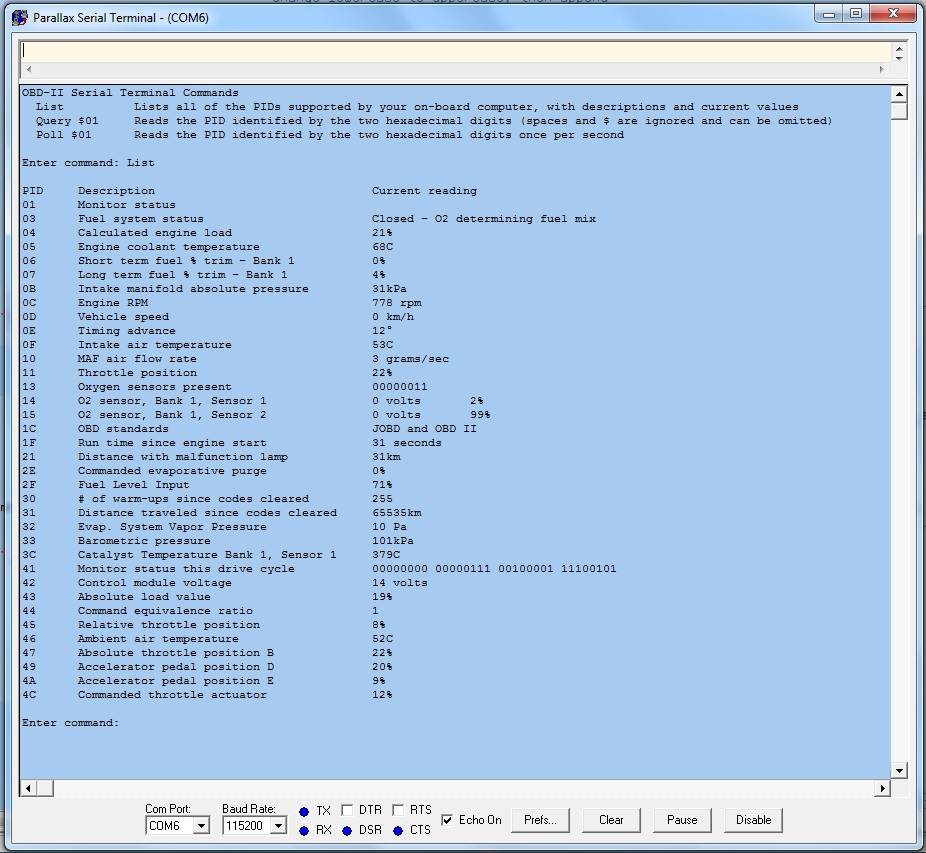

# Propeller-based OBD-II Terminal using CAN bus

By: Chris Gadd

Language: Spin, Assembly

Created: May 19, 2013

Modified: March 28, 2015

This object permits the Propeller to communicate with a vehicle's on-board computer through CAN. Designed specifically for OBD-II, it communicates at 500Kbps, send queries to the on-board computer and stores the response data in a buffer for use by other methods. This object requires a CAN transceiver chip such as the Microchip MCP2551 to perform level shifting and line driving, all other aspects of the CAN protocol are handled by the Propeller. Includes a demo routine, which uses a serial terminal to send commands to and display responses from the main OBD object.

