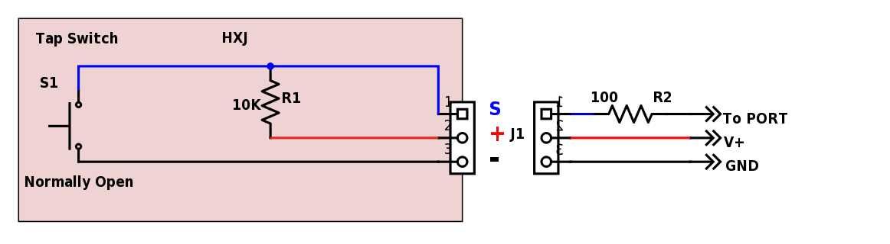

# Pulse Duration Monitor

By: Miro Kefurt

Language: Spin

Created: Jul 4, 2017

Modified: July 4, 2017

This Spin Object Monitors Normally HI (3.3V) P10 for LO (GND) Pulse and prints out the pulse duration in Clock Ticks, micro-seconds and milli-seconds on PST.

P26 is used to show when the P10 is LO.

This Object is useful for Pulse Duration detection from various modules that are available for Arduino, but for which there are no specifications, such as Tilt, Tap, Shock, Hall and Reed switch modules.

The Object can be also used to measure Pulse Duration of various mechanical switches and realys as it operates fast enough to show any switch bounce.

Therefore it can be used to evalueate various switch debounce techniques. The wiring diagram is typical of  Tap, Shock or Tilt Modules. (HXJ-Tap-Sensor-13-1.png)

