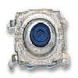

# Pushbutton state reader

By: microcontrolled

Language: Spin

Created: Apr 12, 2013

Modified: April 12, 2013

Read pushbutton states without 10k pull-up resistors! This is neither a big nor impressive object, but it is a useful object. I find that while experimenting I run out of pull-up resistors for pushbuttons. This becomes a big deal, as the pushbuttons often return false signals. Here I have developed an object that turns the pin to output, outputs and positive charge and then immediately switches back to input and reads the "ina" register. It works great! Just like you have a pull-up, but you don't! I also have 3 additional PUB's (all use the same method) that take a timeout, wait for a button press, and one that reads a specified group of inputs. If you just need the simple button reading, you can remove all of the PUB's except it and the object only consumes 10 longs.

**WARNING!!!! You will need a 330ohm resistor tied to the end of the buttons before they are grounded or the program will cause a short circuit! 1 resistor can support multiple buttons.**
