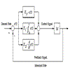

# Quadrature Encoder and PID Controller Driver

By: Kwabena W. Agyeman

Language: Spin, Assembly

Created: Apr 16, 2013

Modified: August 20, 2014

A quadrature encoder and PID controller driver that runs in one cog. The code has been fully optimized with a super simple spin interface for maximum speed and is also fully commented.

Provides full support for:

*   Getting the quadrature encoder's current position and position delta in ticks.
*   Setting the quadrature encoders current speed in ticks per second through PID control through a standard DC motor.

This code is designed for one motor/encoder combo.

**WARNING:** This object has been found to miss ticks. Please use the Parallax encoder object if you need positional information. This object was designed to be used for speed control of your robot. Missing ticks in this case was not a problem when this object was developed.
