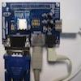

# QuickVGA+ Nunchuk Test

By: saundby

Language: Spin

Created: Apr 16, 2013

Modified: April 16, 2013

A version of jm\_nunchuk\_test\_v3.spin for the Gadget Gangster QuickVGA+ board. This program is "plug and play" with the board's nunchuck pinout, uses the board's VGA display for output (as opposed to the original demo's use of the serial terminal), and displays additional information about the nunchuck state to make it easier to see what effect the inputs are having.

jm\_nunchuk\_ez\_v3 required, available for d/l at Gadget Gangster site (under Nunchuck resources.)
