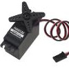

# RC_Servo_Control

By: Gavin Garner

Language: Spin, Assembly

Created: Apr 16, 2013

Modified: April 16, 2013

These are five programs that demonstrate various techniques for controlling RC servomotors with the Propeller chip. These are meant to be used as samples/demos, and I’ve included thorough comments that explain exactly how to use them in your own code. They are designed to be very easy to understand and adapt to fit into your own code and applications. They all dedicate a separate cog to the creation of a continuous stream of servo pulses. Once the code is running on a separate cog, a servo’s position can be changed by simply changing the value of its “position” variable in the main Hub RAM (using Spin or assembly code such as “position:=110\_000”). In your own applications, you could replace the 1 second waitcnt pauses that I have in my “Demo” method with any other operations you need to perform. Single\_Servo\_Spin shows you how to control a motor using a few simple lines of Spin. Although this is easy to understand, it is has very poor position resolution (around 175 possible positions). Single\_Servo\_Assembly demonstrates how to control one RC servomotor by running a simple assembly program on a separate cog. The output pulse resolution for this technique is between 12.5-50ns when using an 80MHz system clock, which in theory corresponds to up to around 140,000 possible positions for a Parallax/Futaba Standard Servo. Two\_Servo\_Assembly and Three\_Servo\_Assembly demonstrate how to control multiple servos by running an assembly program on a separate cog. Once you understand how these two programs work, you could easily modify/expand them to control up to around ten RC servomotors. (Just reduce the “LowTime” value so that, in total, there is about 20ms between the pulses for each motor.) Because the servo pulses are sent out one after another (back to back), the current drawn by each servo will also be staggered. (If you need to control more than ten servos and don’t need as high of a position resolution, try using the Servo32v3 object in the Propeller Library.) Finally, I’ve included a program called Single\_Servo\_Counter that demonstrates how to use a cog’s counter to create a servo pulse. If you actually find that you are maxing out all of your Propeller chip’s processing capabilities in a particular application, you could apply this technique and try to squeeze a few more lines of code in while the cog is not busy setting up its counter. In general, I think that the servo control technique based on assembly code is probably the most logical and robust choice. I hope that these help people out!
