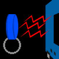

# RFID PASM Reader

By: Brandon Nimon

Language: Spin, Assembly

Created: Apr 16, 2013

Modified: April 16, 2013

Simple concept: read RFID tags from Parallax's RFID reader using PASM. It can check them against a known list of tags, or just output the tag. It can also disable or enable the reader with a simple method interface.

The list of tags can be in the child object, the parent object, or determined and supplied at run-time.

It has been tested at frequencies as low as 5MHz and as high as 100MHz with no problems.
