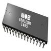

# SIDcog v1.3

By: Johannes Ahlebrand

Language: Spin Spin, Assembly

Created: Apr 16, 2013

Modified: February 6, 2017

An emulation of the famous sound chip in the Commodore 64 running in a single cog. It is much closer to the 8580 than the 6581 when it comes to filter emulation and combined waveforms.

**SIDcog version 1.3 features:**

*   Runs in one cog - totally self contained
*   31kHz sample rate
*   \>16bit internal resolution
*   \>12bit external resolution (duty DAC)
*   Full filter support - any combination of Lowpass, Bandpass and Highpass filter
*   Full envelope support with a logarithmic release/decay curve (uses the same logarithmic approximation as a real SID)
*   Supports all basic waveform types (Square, Saw, Triangle, Noise) 
*   Combined waveform support 
*   16 steps main volume
*   Waveform reset bit works (many Rob Hubbard tunes relies on this exact behaviour)
*   Ring modulation
*   Oscillator synchronization
*   Can be programmed in the exact same way as a real SID (Have a look at the official SID documentation for a better understanding)

The SID chip was used in:

*   Commodore's CBM-II
*   Commodore 64 (C64)
*   Commodore 128 (C128)
*   Commodore MAX

**A discussion thread on Parallax forums regarding SIDcog can be found at: **

*   http://forums.parallax.com/showthread.php/118285-SIDcog-The-sound-of-the-Commodore-64-!-(Now-in-the-OBEX)?highlight=Ahle2

_TAGS: Synthesizer, Music, Sound generation, Oscillator, Retro, PSG, Pulse waveform, Square waveform, Noise waveform, Triangle waveform, Saw waveform, White noise, Subtractive synthesizer, Filter, Resonance Filter, High-pass Filter, Low-pass Filter, Band-pass Filter, Hp Filter, Lp Filter, Bp Filter, Analog synthesizer, Ring Modulation, Synchronization, Sync modulation, Envelope, Polyfonic synthesizer, Frequency Modulation, Frequency synthesis, Amplitude Modulation, Pulse Width Modulation, PWM, Sound playback, Sound output, Sound synthesis, Audio playback, Audio generation, Audio output, Signal generation, Game_
