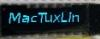

# SSD1306 OLED Driver

By: MacTuxLin

Language: Spin

Created: Nov 30, 2013

Modified: November 30, 2013

This driver would support any OLED display that uses the SSD1306 from Soloman Systech. The chip supports up to 128 x 64 dot matrix but my code was written for 96 x 16 dot matrix. You will need to make the necessary changes to support other display specifications. 

This would also support Sabernetics OLED (96x16).
