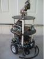

# SSD1306_Driver_Plus

By: Larry Wendell

Language: Spin

Created: Apr 2, 2019

Modified: April 5, 2019

This object will allow you to write to an OLED screen with the SSD1306 Driver.  The code, as it stands, will write to the .96" I2C 128x64 Display Module that is available on eBay and other sources for about $8.00.  The SSD1306 initiation routine can easily be modified to accomodate other size screens, i.e., 16x128.  Use is very straight forward.  This latest update (v - 1.3) works similularly to FullDuplexSerialPlus.  A test program is included for example use.  Enjoy
