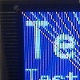

# SSD1351 128x128 OLED parallel driver

By: MarkT

Language: Spin, Assembly

Created: Apr 16, 2013

Modified: April 16, 2013

Preliminary driver for SSD1351 OLED controller in 8-bit parallel 8080 mode. Tested on Desnitron display module DD-128128FC-6A (order code 182-9707 from Farnell)

Drives the standard 8 bit databuse and nRES, nCS, nWR, nRD and D/nC lines, plus a pin to control the 13V Vcc power
